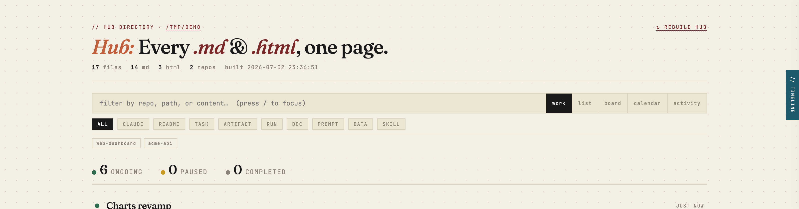
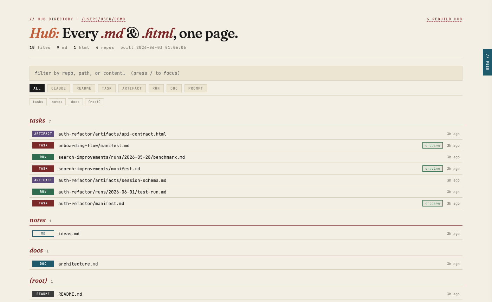
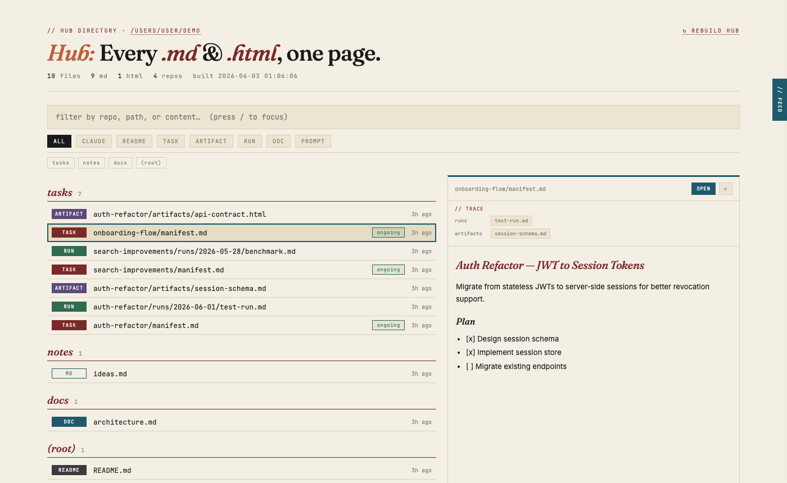
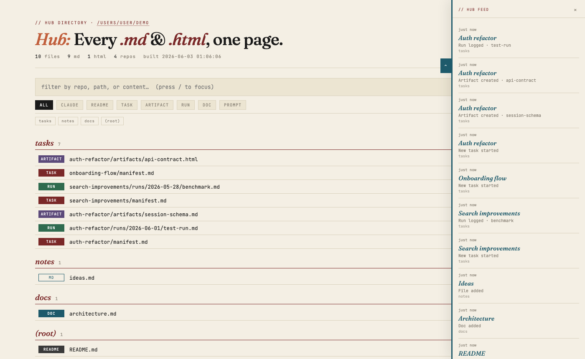
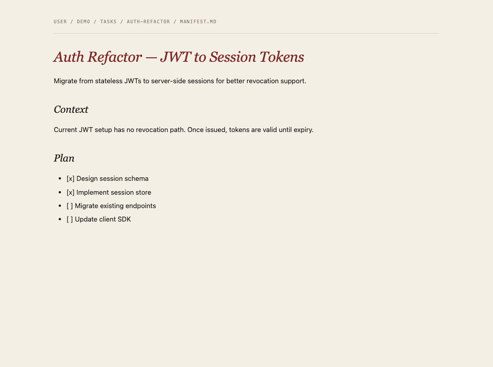
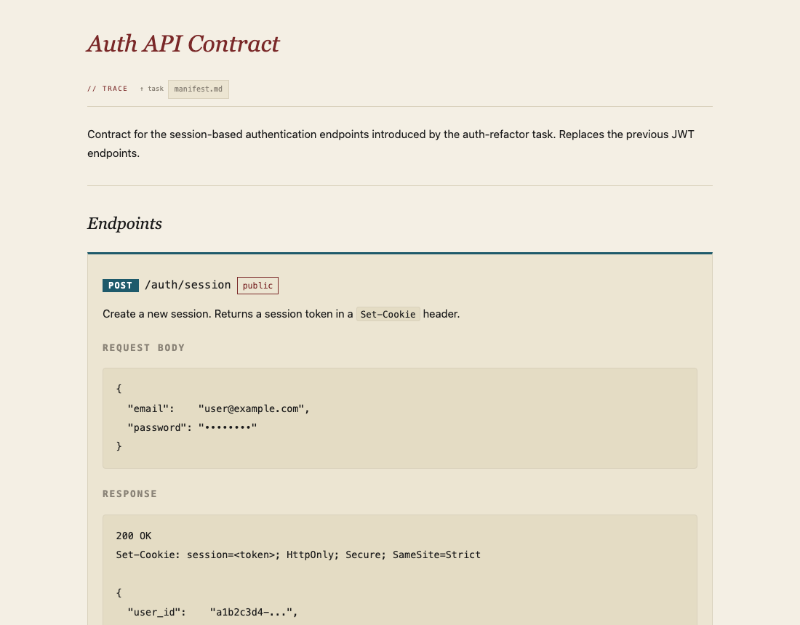

<div align="center">

# Hub

**Every `.md` and `.html` in your projects — one searchable, previewable page.**

</div>

Hub scans a directory tree, indexes every document into SQLite with full-text search and task lineage, and serves a fast local browser at `http://localhost:8787`. No npm. No framework. Pure stdlib Python.

---

### Index — grouped by repo, filtered by kind, sorted by recency
Status badges on every task manifest. Click to cycle `ongoing → completed → paused`, saved instantly.



### Split-pane preview with task trace
Click any row to open a live preview. The `// trace` panel links to related runs, artifacts, and the parent task.



### Hub Feed — floating activity drawer
Press `Ctrl+F` or click the `// feed` tab on the right edge. Shows the last 50 file events across the scan root — what changed, which task, when.



### Markdown document page
Every file opened in its own tab gets a clean reading view with a `// trace` bar below the heading.



### HTML document page
HTML artifacts are served with the hub's own CSS injected and the `// trace` bar linking back to the parent task.



---

## Features

- **Full-text search** — filter by repo, path, title, and body simultaneously. Implicit AND, `repo:name` prefix supported.
- **Kind chips** — one-click filters for TASK, RUN, ARTIFACT, CLAUDE, README, DOC, PROMPT. Stack with repo chips and search.
- **Task status badges** — every task manifest shows a clickable status pill. Cycles `ongoing → completed → paused`. Persisted to `~/.hub-state/` — survives DB resets, scan root changes, and git branch switches.
- **Split-pane preview** — click any row for a live rendered preview with lineage trace. No page navigation needed.
- **Hub Feed** — floating drawer (`Ctrl+F`) showing recent file activity: what changed, which task, how long ago. Persisted across rebuilds, backfilled on first run.
- **Backlinked doc pages** — open any file in its own tab and the `// trace` bar appears below the heading, linking to all related files. Works for `.md` and `.html`.
- **Auto-rebuild** — file watcher triggers a rebuild within ~3s of any change in the scan root.
- **Keyboard-first** — navigate the full list without a mouse.

---

## Quick start

```bash
# Start the server (auto-starts at login via launchd)
python3 ~/agents/hub/server.py

# Rebuild the index
HUB_SERVER_PORT=8787 python3 ~/agents/hub/hub.py

# Open
open http://localhost:8787/
```

Two launchd agents keep everything running at login:

| Agent | Behaviour |
|-------|-----------|
| `com.user.hub-server` | HTTP server + file watcher. KeepAlive. |
| `com.user.hub` | Rebuilds index every 120s. |

Set up both agents with one script:

```bash
bash scripts/setup-launchd.sh
```

Reload after code changes:
```bash
launchctl kickstart -k gui/$(id -u)/com.user.hub-server
launchctl kickstart -k gui/$(id -u)/com.user.hub
```

---

## Task structure

Hub understands this layout and builds a lineage graph automatically:

```
{repo}/tasks/{slug}/
    ├── manifest.md        ← TASK  (links to all below)
    ├── runs/YYYY-MM-DD/   ← RUN   (↑ back-link to manifest)
    ├── artifacts/         ← ARTIFACT
    └── prompts/           ← PROMPT
```

---

## Search

| Query | Finds |
|-------|-------|
| `session tokens` | files whose title or body contains both words |
| `repo:tasks manifest` | manifests in the tasks repo |
| `auth artifact` | artifacts from auth-* tasks |
| `repo:docs architecture` | docs matching "architecture" |

---

## Keyboard shortcuts

| Key | Action |
|-----|--------|
| `/` | Focus search |
| `Ctrl+F` | Toggle hub feed drawer |
| `j` / `↓` | Next file |
| `k` / `↑` | Previous file |
| `Enter` | Open in new tab |
| `Esc` | Close preview / feed |

---

## Changing the scan root

Click the scan-root path in the header → edit → **Save & Rebuild**. The server writes `.scan_root`, rebuilds, and reloads automatically.

Priority: `HUB_SCAN_ROOT` env var → `.scan_root` sidecar → `~/tifin` default.

---

## Configuration

| Var | Default | Purpose |
|-----|---------|---------|
| `HUB_SCAN_ROOT` | `~/tifin` | Directory to scan |
| `HUB_SERVER_PORT` | `8787` | Server port |
| `HUB_OUTPUT` | `build/docs-index.html` | Output HTML path |
| `HUB_DB` | `~/.hub-state/hub.db` | SQLite database |
| `HUB_DEBUG` | off | `1` enables logging to `.hub.log` |

---

## File structure

```
hub/
├── hub.py              scan, index, render
├── server.py           HTTP server · markdown renderer · file watcher
├── db.py               SQLite — files, lineage, FTS5, task_status, activity_log
├── metadata.py         title + body extraction
├── templates/
│   └── template.html   single-file HTML/CSS/JS template
├── assets/
│   ├── favicon.svg
│   └── screenshots/
└── build/              generated — safe to wipe
    └── docs-index.html

~/.hub-state/           persistent state — do not delete
├── hub.db              SQLite database (all tables)
└── task-status.json    sidecar backup of task statuses
```

